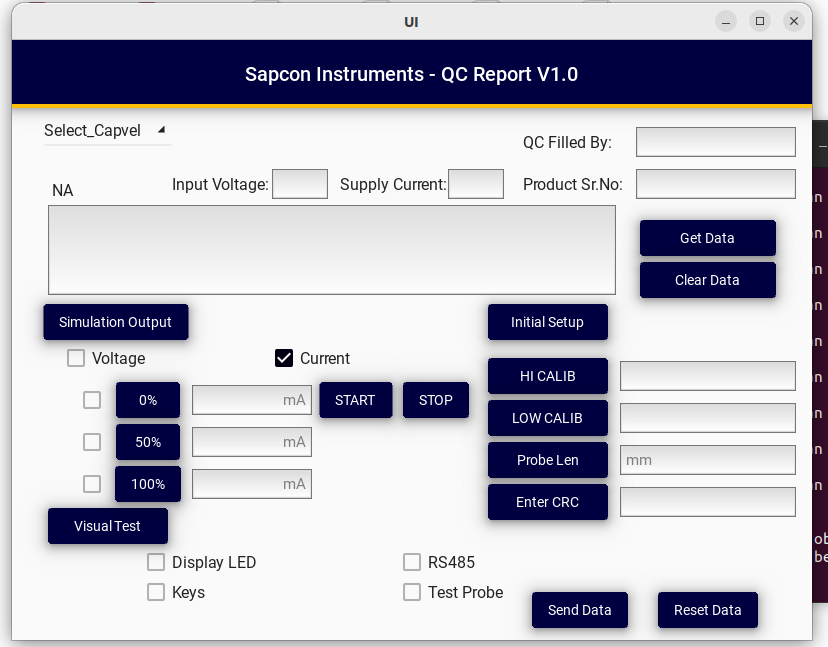

# Project-UI
Non commercial Project, helps in automamtion in Sapcon Instruments Pvt. Ltd. [https://www.sapconinstruments.com/]

# Data Acquisition System using RS485 Multimeter

## Project Overview
This project implements a Data Acquisition System (DAQ) that communicates with a digital multimeter using the RS485 protocol to acquire, process, and monitor electrical parameters such as voltage, current, and resistance.

The system is designed for reliable long-distance and noise-immune industrial communication.

---

## Objectives
- Interface a digital multimeter using RS485 communication  
- Acquire real-time electrical measurement data  
- Process and convert raw data into physical values  
- Display and/or store data for monitoring and analysis  

---

## System Architecture
Components used:
- Digital multimeter with RS485 output  
- Microcontroller / Embedded controller  
- RS485 to UART/USB converter  
- PC or embedded display system  
- Power supply and isolation circuitry  

Data Flow:
Multimeter → RS485 → Controller → Data Processing → Display/Storage

---

## Communication Details
- Protocol: RS485 (Half duplex)  
- Interface: UART based serial communication  
- Features:
  - Long-distance support  
  - High noise immunity  
  - Multi-drop capability  

---

## Software Description
- RS485 driver initialization  
- Command transmission to multimeter  
- Real-time data reception  
- Data parsing and scaling  
- Error handling and timeout management  
- Optional data logging and visualization  

---

## Implementation
- Firmware developed using Embedded C / C++  
- UART with RS485 transceiver used for communication  
- Modular code structure  
- Supports calibration and filtering  

---

## Applications
- Industrial data acquisition systems  
- Automated testing equipment  
- Power and energy monitoring  
- Laboratory instrumentation  
- Remote parameter monitoring  

---

## Key Highlights
- Robust RS485 communication  
- Real-time data acquisition  
- Scalable and industrial-grade design  

---

## Future Enhancements
- GUI dashboard integration  
- Wireless communication support  
- Cloud or SD card data logging  
- Multi-device RS485 network
---
## Author  

Prajaktaa Deokar  
Embedded Systems | Industrial Automation | Orbit | Sapcon Instruments Pvt. Ltd. 
